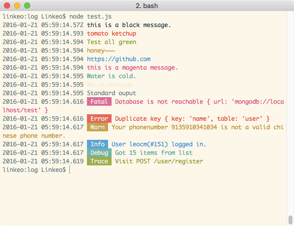

# RainbowLog

Log with color.

> Only work in Unix-based systems.

#### Progress

- [x] Format Output, Multi-levels.
- [x] Print `error(...args)`, `fatal(...args)` to stderr.
- [ ] Write to log file, split by day(split at 00:00).

## Installation

```sh
npm install --save rainbowlog
```

## Usage

```js
var log = require('rainbowlog');

log.prod = true; // default to false

log.log('standard output with timestamp'); // 2016-01-21 03:54:56.503 standard output with timestamp
log.debug('debugging output %s', 'haha'); // 2016-01-21 03:54:56.505  [Debug]  debugging output haha
```

## Logging Functions

Logging functions can be used by the same way as Node.js's `console.log(...args)`:

> Prints to stdout with newline. Multiple arguments can be passed, with the first used as the primary message and all additional used as substitution values similar to printf() (the arguments are all passed to util.format()).
> 
> ```
> var count = 5;
> console.log('count: %d', count);
>   // Prints: count: 5, to stdout
> console.log('count: ', count);
>   // Prints: count: 5, to stdout
> ```
> 
> If formatting elements (e.g. %d) are not found in the first string then util.inspect() is called on each argument and the resulting string values are concatenated. See util.format() for more information.
> 
> *Referenced from [Node.js's document.](https://nodejs.org/api/console.html#console_console_log_data)*

### Simple output

Prepend timestamp only.

- `log(...args)`
- `standard(...args)`, equivalent to `log(...args)`

### Colored Output

Prepend timestamp and color the text for output.

- `black(...args)`
- `red(...args)`
- `green(...args)`
- `yellow(...args)`
- `blue(...args)`
- `magenta(...args)`
- `cyan(...args)`
- `white(...args)`

### Multi-level Output

Prepend timestamp and a level tag, also color the output text.

- `trace(...args)`, doesn't print in prod mode (`prod=true`)
- `debug(...args)`, doesn't print in prod mode (`prod=true`)
- `info(...args)`
- `warn(...args)`
- `error(...args)`
- `fatal(...args)`

## Example

```js
// test.js
var log = require('./index.js');

// log.DebugMode = false;
log.black('this is a black message.');
log.red('tomato ketchup');
log.green('Test all green');
log.yellow('honey~~~');
log.blue('https://github.com');
log.magenta('this is a magenta message.');
log.cyan('Water is cold.');
log.white('White message...');
log.standard('Standard ouput');
log.fatal('Database is not reachable', {url: "mongodb://localhost/test"});
log.error('Duplicate key', {key: "name", table: "user"});
log.warn('Your phonenumber %s is not a valid chinese phone number.', '9135910341034');
log.info('User %s(#%d) logged in.', 'leocm', 151);
log.debug('Got %d items from list', 15); // will not display if DebugMode==false
log.trace('Visit %s %s', 'POST', '/user/register'); // will not display if DebugMode==false
```

Prints:

